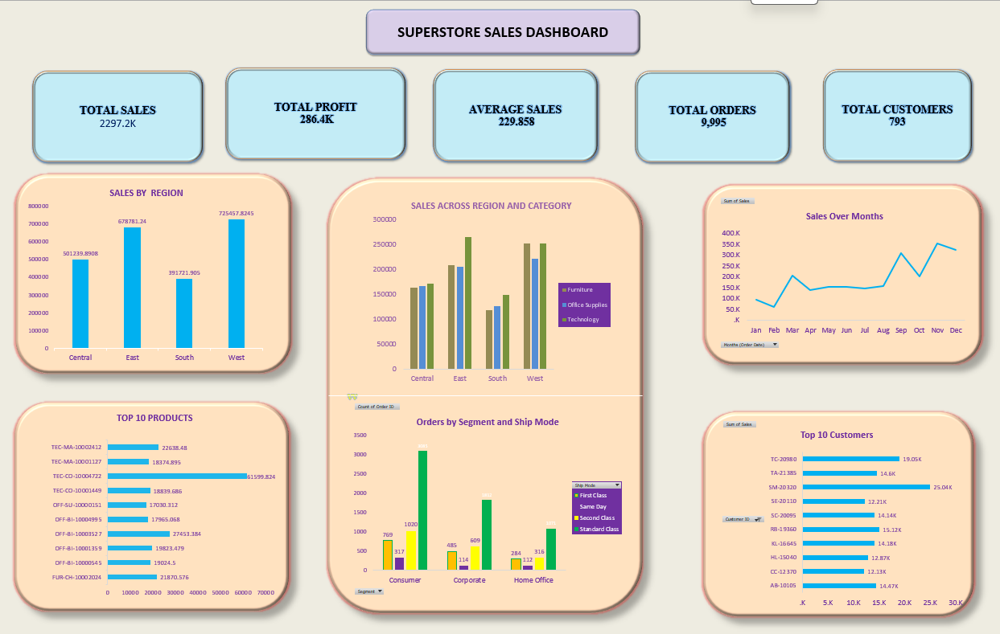

# 📊 Superstore Sales Dashboard

An interactive **Excel dashboard** (PivotTables + PivotCharts + Slicers) built on the classic **Sample Superstore** dataset, analyzing sales, profit, orders, and customers across the United States (2014–2017).



---

## 📁 Repository Structure

```
Superstore-Sales-Dashboard/
│
├── data/
│   ├── Sample_Superstore_raw_table.xls        # Original, unprocessed dataset
│   └── superstore_sales_dashboard_cleaned.xlsx # Cleaned & feature-engineered data (Orders sheet)
│
├── dashboard/
│   └── superstore_sales_dashboard.xlsx         # Final interactive Excel dashboard (KPI, Dashboard, Charts sheets)
│
├── screenshots/
│   └── Superstore_Sales_Dashboard.png          # Snapshot of the final dashboard
│
├── README.md                                   # Project overview (this file)
└── Documentation.md                            # Detailed project documentation
```

---

## 🎯 Project Overview

This project transforms raw retail transaction data into a single-page, decision-ready Excel dashboard for a fictional superstore chain. It answers core retail questions — which regions, categories, products, and customers drive sales and profit — using PivotTables, PivotCharts, and interactive slicers, with no external BI tool required.


---

## 🗂️ Dataset

| Detail | Description |
|---|---|
| Source file |  **[Sample_Superstore_raw_table.xls](https://github.com/DRasool7013/Superstore-Sales-Profit-Analysis-Dashboard/blob/main/Sample%20-%20Superstore_raw_table.xls)**.|
| Records | 9,994 orders |
| Time period | 2014 – 2017 |
| Columns | Order ID, Order/Ship Date, Ship Mode, Customer, Segment, Region, State, City, Category, Sub-Category, Product Name, Sales, Quantity, Discount, Profit |
| Supporting sheets | `People` (Regional Manager per Region), `Returns` (Returned Order IDs) |

---

## 🛠️ Tools & Techniques Used

- **Microsoft Excel** — PivotTables, PivotCharts, Slicers
- Data cleaning: removing duplicates, fixing data types, handling blanks/nulls
- Feature engineering: Month, Year, Day, Weekday, No. of Days (Order → Ship), Discount Type, Profit/Loss flag, Order Status, Customer Value Segment
- KPI cards built with linked cell references
- Cross-filtering via slicers (Region, Category, Segment, Ship Mode, Month/Year)

---

## 📌 KPIs

| KPI | Value |
|---|---|
| Total Sales | **2,297.2K** |
| Total Profit | **286.4K** |
| Average Sales | **229.858** |
| Total Orders | **9,995** |
| Total Customers | **793** |

---

## 📊 Charts & Visuals

| Chart | Type | Insight |
|---|---|---|
| Sales by Region | Column chart | Compares total sales across Central, East, South, West |
| Sales Across Region and Category | Clustered column chart | Furniture / Office Supplies / Technology sales split by region |
| Sales Over Months | Line chart | Monthly sales trend (Jan – Dec) |
| Top 10 Products | Horizontal bar chart | Best-selling products by sales value |
| Orders by Segment and Ship Mode | Clustered column chart | Order volume by Consumer/Corporate/Home Office segment and ship mode |
| Top 10 Customers | Horizontal bar chart | Highest-spending customers by sales |

---

## 💡 Key Insights

- **West** and **East** regions generate the highest sales (~725K and ~679K respectively), while **South** lags behind at ~392K.
- **Technology** and **Office Supplies** consistently outsell **Furniture** across every region.
- Sales show a **strong upward trend from September to December**, indicating seasonal/holiday demand.
- The **Consumer** segment places the most orders across all shipping modes, with **Standard Class** the dominant ship mode overall.
- A small group of top customers and products contribute disproportionately to total revenue (classic 80/20 pattern).

For the full breakdown of analysis questions and answers, see **[Documentation.md](https://github.com/DRasool7013/Superstore-Sales-Profit-Analysis-Dashboard/blob/main/Documentation%20.md)**.

---

## 🚀 How to Add This Project to GitHub

```bash
# 1. Create a new folder and move all project files into it
mkdir Superstore-Sales-Dashboard
cd Superstore-Sales-Dashboard

# 2. Initialize git
git init

# 3. Add a .gitignore (optional, for temp Excel lock files)
echo "~$*.xlsx" >> .gitignore
echo "~$*.xls" >> .gitignore

# 4. Stage all files
git add .

# 5. Commit
git commit -m "Add Superstore Sales Dashboard: data, dashboard, docs, and screenshot"

# 6. Create a new repository on GitHub (via github.com -> New Repository)
#    Name it: Superstore-Sales-Dashboard

# 7. Link local repo to GitHub and push
git remote add origin https://github.com/<your-username>/Superstore-Sales-Dashboard.git
git branch -M main
git push -u origin main
```

### Repo setup checklist
- [x] Add raw dataset to `data/`
- [x] Add cleaned dataset to `data/`
- [x] Add final dashboard workbook to `dashboard/`
- [x] Add dashboard screenshot to `screenshots/`
- [x] Write `README.md`
- [x] Write `Documentation.md`
- [ ] Add repository description & topics on GitHub (`excel`, `data-analysis`, `dashboard`, `pivot-tables`, `superstore`)
- [ ] Pin repository on your GitHub profile

---

## 👤 Author

Add your name, LinkedIn, and portfolio link here.

## 📄 License

This project uses the publicly available Sample Superstore dataset for educational/portfolio purposes.
